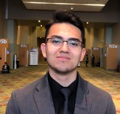

# CARLOS GUERRERO 



Readme is found [**here**](/README.md)


#### **Table of Contents**
1. [Summary](#summary)
2. [Skills](#skills)
3. [Projects](#projects)
4. [Goals](#goals)
5. [Random Facts](#facts)
6. [Contact me](#contact)

### **Summary**<a name="summary"></a>
Hello, I am a student from the University of California, San Diego and I am on my 3rd year of my computer science bacehlors of science. I am interested in game development and am beginning to take a slight interest in cryptography and computer security.

### **Skills:**<a name="skills"></a>
* C++
* Java
* HTML
* CSS
* SQL

### **Projects Completed/In Progress**<a name="projects"></a>
- [x] A file compression and decompression algorithm. (Completed)
- [ ] A ticket system where users can make, finish, or edit requests. (progress)
- [ ] A platform video game (progress)
- [x] Hello World programm:
  ``` 
    #import <iostream>

    int main(){
        std::cout << "Hello, World!" << std::endl;
        return 0;
    }

### **My Goals Include:**<a name="goals"></a>
* Contributing to some project I can proudly claim has had a positive influence in the world.
* Getting a job in the internet security field.
* Developing my own video game and be able to publish it.

### **A Few Random Facts About Me:**<a name="facts"></a>
* My favorite programming language is C++.
* I like to play video games on my time off. 
* My favorite quote from The Office: 
  > "You miss 100% of the shots you don't take 
  >     -Wayne Gretzky"
  > 
  >    -Michael Scott
* My favorite song is
[**this**](https://youtu.be/dQw4w9WgXcQ).

### **Conact me through LinkedIn** 
[***HERE***](www.linkedin.com/in/carlos-guerrero7b9317b)